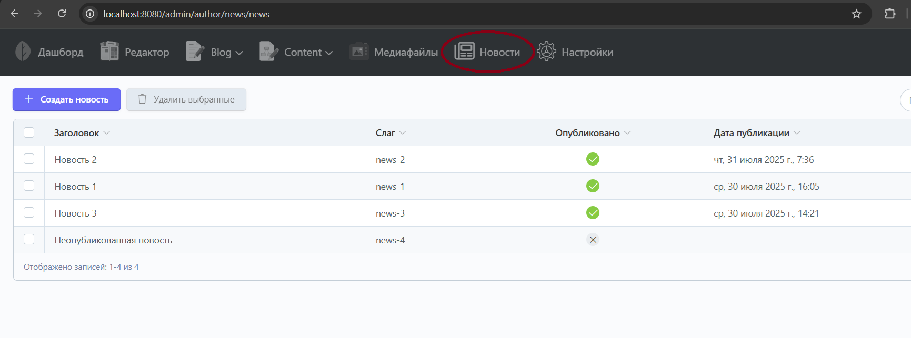
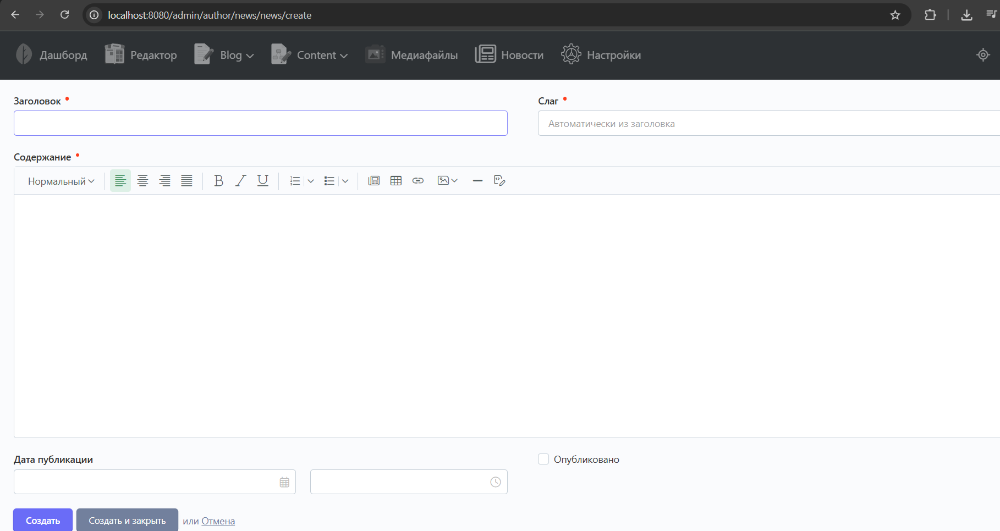
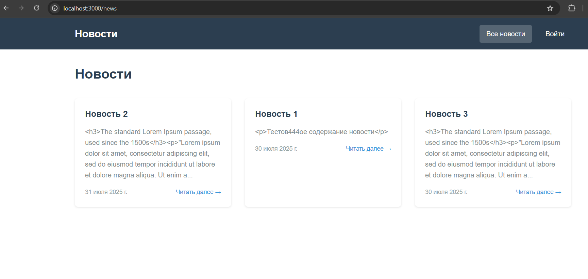
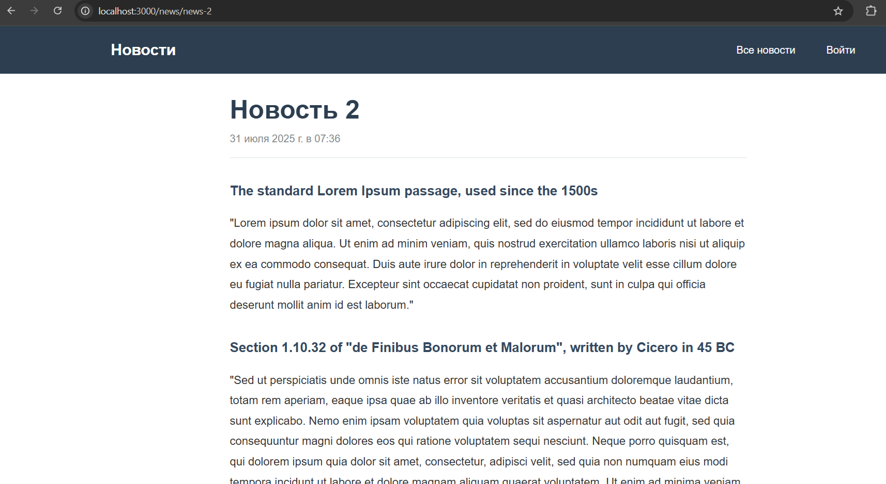
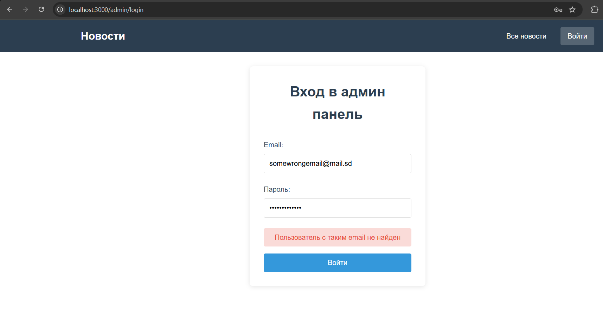
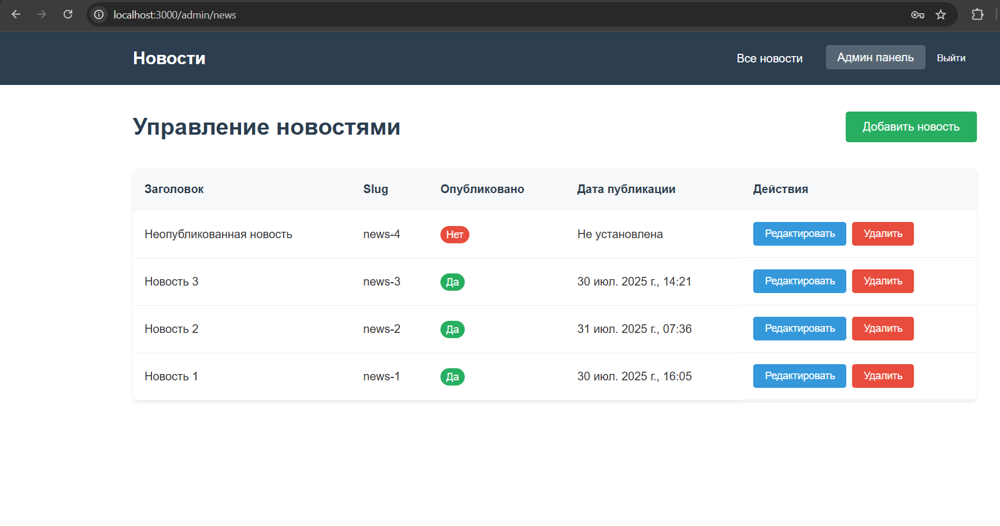
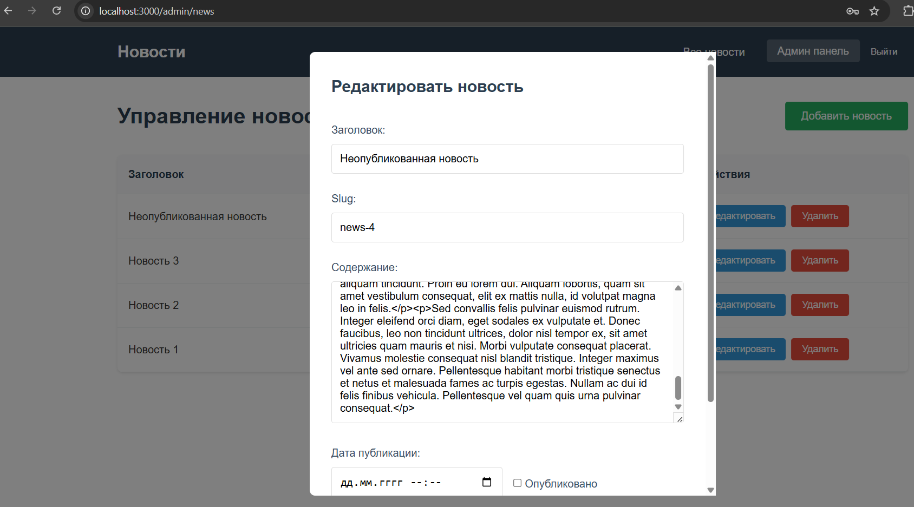

# Модуль новостей October CMS + Vue.js SPA

### 1. Клонирование и подготовка

```bash
git clone https://github.com/rivexe/news-october-cms-vue-spa
```

### 2. Запуск Docker контейнеров

```bash
docker-compose build october_cms
docker-compose up postgres -d
docker-compose up october_cms -d
```

### 3. Настройка October CMS

```bash
docker-compose exec october_cms bash
php artisan october:install
```

### 4. Активация плагина новостей

```bash
# Внутри контейнера october_cms выполняем:
php artisan plugin:refresh Author.News
```

### 5. Запуск Frontend

```bash
docker-compose up frontend -d
```

### 6. API endpoints

### Публичные
- `GET /api/news` - список опубликованных новостей
- `GET /api/news/{slug}` - детальная информация о новости

### Требуют авторизации
- `POST /api/auth/login` - авторизация
- `GET /api/admin/news` - все новости для админки
- `POST /api/news` - создание новости
- `PUT /api/news/{id}` - обновление новости
- `DELETE /api/news/{id}` - удаление новости

### 7. Использование

### Административная панель October CMS
1. Откройте `http://localhost:8080/admin`
2. Войдите с данными админа
3. Используйте встроенные возможности October CMS



### Публичная часть (SPA на Vue.js)
1. Откройте `http://localhost:3000/`
2. Просматривайте список опубликованных новостей
3. Кликните на новость для детального просмотра




### Административная часть (SPA на Vue.js)
1. Откройте `http://localhost:3000/admin/login`
2. Войдите с данными админа (обращение по API к приложению на October CMS)
3. Управляйте новостями: создавайте, редактируйте, удаляйте


